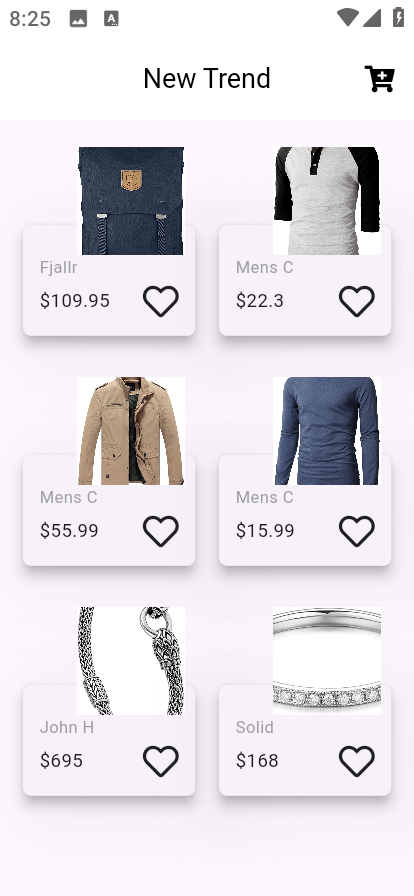
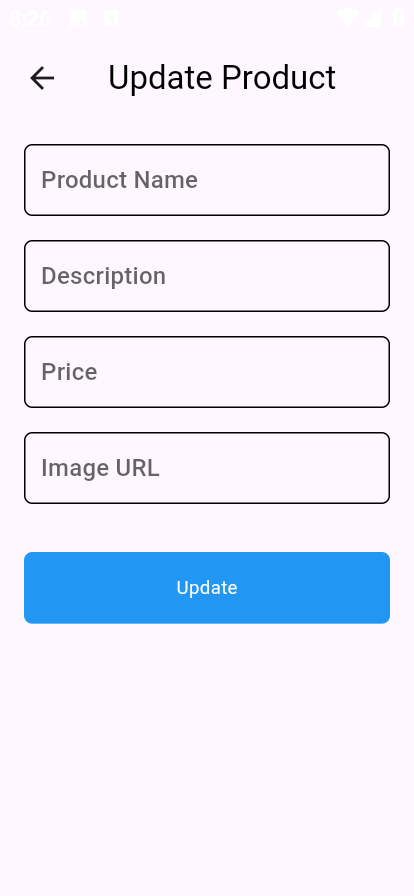

# Store App

A dynamic and responsive Flutter application for managing and browsing a collection of products. This app includes functionalities to display, add, update, and categorize products, leveraging a modern UI and API integration.

## Table of Contents

- [Features](#features)
- [Screenshots](#screenshots)
- [Technologies Used](#technologies-used)
- [Setup](#setup)
- [API Integration](#api-integration)
- [Responsive Design](#responsive-design)

## Features

- **Product Listing**: View a list of products fetched from a remote API.
- **Product Categories**: Browse products by categories.
- **Update Products**: Modify existing product details.
- **Add New Products**: Add new products with title, price, description, image, and category.
- **Responsive Design**: Adapts to different screen sizes and orientations.
- **Smooth User Experience**: Includes loaders and feedback mechanisms for API calls.

## Screenshots
Here’s a preview of the Chat App in action:

<p align="center">
  
  
</p>

## Technologies Used

- **Flutter**: Framework for building cross-platform mobile applications.
- **Dart**: Programming language used in Flutter development.
- **HTTP**: Library for making API calls.
- **Modal Progress HUD**: For displaying loading indicators.
- **Font Awesome Flutter**: Icons for enhanced UI.

## Setup

1. **Clone the repository**
   ```bash
   git clone https://github.com/NadaAlaa1/store_app.git
   cd store_app
   
2. **Install dependencies**
   
   Make sure you have Flutter installed. Then, run the following command to install the required packages:
   ```bash
   flutter pub get
     
3. **Run the App**
   ```bash
   flutter run

## API Integration

The app interacts with [FakeStoreAPI](https://fakestoreapi.com/) for product data.
### **Endpoints Used**:

  - `GET /products`: Fetch all products.
  - `GET /products/categories`: Fetch all categories.
  - `GET /products/category/{categoryName}`: Fetch products by category.
  - `POST /products`: Add a new product.
  - `PUT /products/{id}`: Update product details.
  
### How to Use

1. View Products: Launch the app to see a grid of products.
2. Add a Product: Implemented through the AddProduct service.
3. Update a Product: Tap on a product card to navigate to the update page.
4. View Categories: Implemented in CategoriesService.

## Responsive Design

The app dynamically adjusts:

- Grid layout based on screen size.
- Padding, spacing, and font sizes for different screen dimensions.
